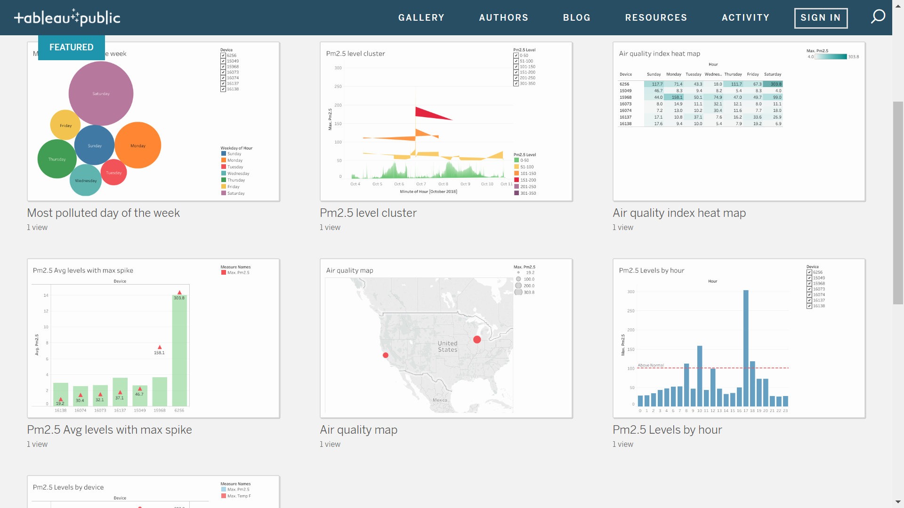

iotbch
======

BCHDevcon 2019 Hackathon Project

# Introduction

Internet of Things (IoT) is gaining popularity. A good example is [PurpleAir.com](https://www.purpleair.com/map#12.58/37.43558/-122.15637). Users buy a PurpleAir air pollution monitor and connect it to their wifi. The monitor submits PM2.5 data to PurpleAir server periodically. However, the user does not have many options when it comes to analyzing their own data or their neighborhood's data.

# Goal

* Provide a simple API for any IoT devices or clients to post time series data to BCH.
* Proof of ownership of the data.
* Compress the raw IoT data to fully utilize the OP_RETURN field at 50% saving, 38 samples per tx. 
* Provide enterprise grade tool to analyze and visualize the data.
* Increase adoption and usage of BCH via IoT devices.

# Benefits
* Permanent storage on BCH for user generated IoT data
* Bring Data Integration (ETL) framework to BCH to organize the OP_RETURN
* Personalized analytics

# Tasks for Hackathon

- [x] Obtain Purple Air data feed from https://github.com/bomeara/purpleairpy/blob/master/api.md
- [x] Select sample 4 devices [devices.json](./devices.json)
- [x] Post datafeed to IoTBCH
- [x] Create a [template](./protobuf/metrics.proto)) from the json datafeed
- [x] Compress the datafeed into byte stream.
- [x] Push compressed data to BCH testnet in the OP_RETURN field
- [ ] Reconstruct feed from BCH OP_RETURN
- [x] Analytics tool to visualize datafeed [Live Dashboad](https://public.tableau.com/profile/michael5102#!/)
- [Most polluted day of the week](./visualization_01.png)
- [Air quality map](./visualization_02.png)
- [Hourly air quality index distribution by device](./visualization_03.png)
- [Pm2.5 Avg levels with max spike](./visualization_04.png)
- [Air quality index heat map](./visualization_05.png)
- [Pm2.5 Levels by device](./visualization_06.png)
- [Pm2.5 Levels by hour](./visualization_07.png)
- [Pm2.5 level cluster](./visualization_08.png)



# Getting Started

## compile protobuf definition

Our RPC server is in JavaScript, it is reponsible for receiving protobuf
messages (IoT device feed metrics) and creating + broadcasting BCH
transactions. To generate the JS protobuf stubs:

`protoc protobuf/metrics.proto --js_out=import_style=commonjs:.`

To continually collect and feed the RPC server w/ device feed metrics we wrote
a Golang daemon to periodically fetch and publish new metrics. To generate the
Go protobuf stubs:

`protoc protobuf/metrics.proto --go_out=plugins=grpc:.`

## run RPC server

1. `npm install`
2. `npm run server`

## run daemon to fetch device metrics (in separate tab)

1. compile feed fetcher daemon `GOOS=linux GOARCH=amd64 go build -o publish-feed-linux-amd64 .`
2. run `./publish-feed-linux-amd64`


# `OP_RETURN` schema + compression

For PurpleAir metrics we store a Protobuf binary serialized representation of
the following:

```
{
  device: "AirMonitor_1f12",
  id: 123,
  lat: 37.435972,
  lon: -122.129822,
  temp_f: 87,
  feed: [
    { ts: <start unix time>, pm2.5: <float> },
    { ts: <diff from start unix time>, pm2.5: <float> },
    { ts: <diff from start unix time>, pm2.5: <float> },
    ...
  ]
}
```

# Examples

```
{ blockchain: 'BCH',
  to_addr: 'qr8ngds6j7ww428mud7fz376z5vj0dn4mgx32xuv9a',
  message: <Buffer 49 6f 54 5f 0a 09 70 75 72 70 6c 65 61 69 72 10 c9 75 1a 06 08 d7 95 fe dd 05 1a 02 08 50 1a 03 08 a0 01 1a 03 08 f0 01 1a 03 08 c1 02 1a 03 08 90 03 ... > }
{ txid: 'e8c5b85518febbbabfad79b90eeb461d82492ee363e34733457509d347f585f7',
  vout: 2,
  address: 'bchtest:qrhn96u0epjuf5d7cx3ynkht2460sm7jwcsfhvjax0',
  account: 'u1',
  scriptPubKey: '76a914ef32eb8fc865c4d1bec1a249daeb5574f86fd27688ac',
  amount: 0.001,
  confirmations: 9978,
  spendable: true,
  solvable: true,
  safe: true }
written bytes=210 txid=9623c784a57ca650b555e9aa9e9ea59d588a2cf2e5fc498943fa5362b5e9e7c3
```


## TXID on testnet

[9623c784a57ca650b555e9aa9e9ea59d588a2cf2e5fc498943fa5362b5e9e7c3](https://www.blocktrail.com/tBCC/tx/9623c784a57ca650b555e9aa9e9ea59d588a2cf2e5fc498943fa5362b5e9e7c3)
